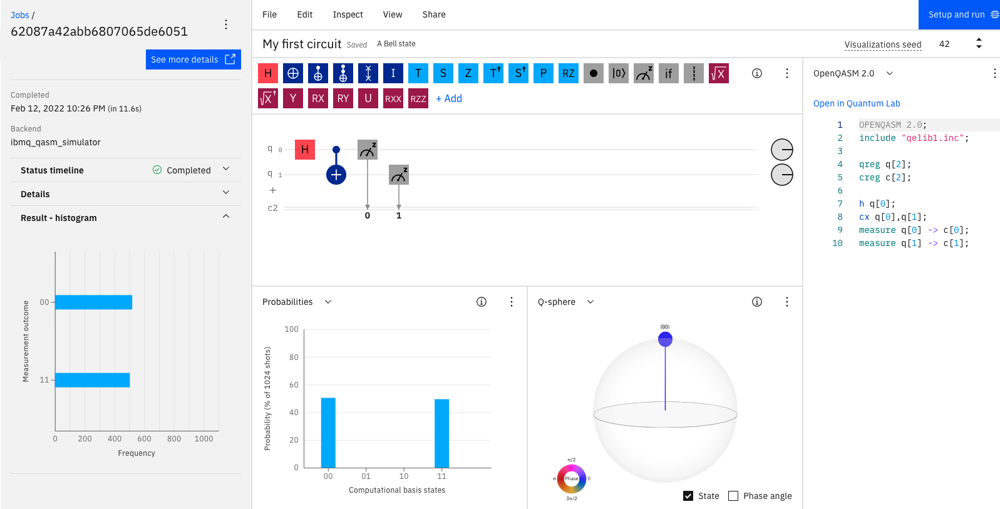

# Quantum Computing Experiments
(Learnings from **The Complete Quantum Computing Course** by *Atil Samancioglu* on Udemy)

## My first circuit
This circuit contains two qubits. One qubit (q0) is superimposed with itself using Hadamard gate. CNOT gate is used to entangle both qubits q0 (controlled qubit) and q1 (target qubit). Both qubits are observed, which leads to disrupting their wave (probable/uncertain) nature, to measure a fixed value. I ran this 1024 times on Qasm simulator which instantly generated the results (left side of the image below) showing superimposed (520 times in state |00>, 504 times in state |11>) nature of both qubits since they are entangled. 

- Learn from https://quantum-computing.ibm.com/ about building the quantum circuit shown above.
- Refer notebooks/HelloQuantum.ipynb notebook to build and execute above circuit in Python programming. You can also check the run on **actual quantum computer** where you will observe the noise as |01> and |10> states' strenghts.

## Quantum Teleportation

First, it is important to understand gates and what they can do to the phase of a qubit. [Here](https://qiskit.org/textbook/ch-states/single-qubit-gates.html) are descriptions of gates with single qubit. You can visualize the phase of a qubit using Blochsphere (different from Q-sphere). Follow [this](./notebooks/3.PhaseAndBlochSphere.ipynb) notebook to understand the visualization of phase using Blochsphere when a gate is applied to qubit(s).

Second, let's learn a bit about [Superdense Coding](https://en.wikipedia.org/wiki/Superdense_coding). Below picture describes Superdense coding; there are roles - Bob, Alice, Eve, which are [fictional characters](https://en.wikipedia.org/wiki/Alice_and_Bob) to discuss Cryptoraphy. In short, Eve has two qubit. One qubit is given to Alice and other to Bob. But before giving these to Alice and Bob, qubits are entangled. Alice sends encrypted information (qubit) to Bob and Bob decrypt the information (to know about classical bits). Alice can use any of 4 gates (I, X, Z, XZ) to encrypt the information. Check that qubit q0 and q1 are entangled meaning if you control q0 then q1 will align itself to be in superposition. After recieving the information from Alice, CNOT gate and Hadamard gate are applied again to measure the information. Finally, you should (ideally) get both qubits in only in one of the 4 states depending one what encryption Alice has performed. Note that Bob doesn't need to know what encryption Alice has applied. 

See what happens when Alice applies I gate (left) or XZ gates (right): 

<!---
 
-->
  

Now, let's discuss [Quantum Teleportation](https://en.wikipedia.org/wiki/Quantum_teleportation).

It is a technique of transporting quantum information from a sender to reciever that are distance apart. Quick question - can you clone classical bit? (Answer - yes) and how about qubit ? (Answer - no). To clone, you need to know the state of the qubit. As soon as you measure it, you disrupt the state. So you can not just copy and paste qubit state.

In the below picture, you have a qubit |$\Psi$> with unknown state. $\alpha$ and $\beta$ are unknown. You and Bob will do some transformation to turn |$\Psi$> state to q2 state. q1 is helper qubit.

(left): Tensor product of |$\Psi$> with entangled state of q1 and q2; (right): Alice applies CNOT gate. 

 

(left): Alice applies Hadamard gate; (right): Measurement

 

As you get one of the measurements (00, 01, 10, 11), Bob knows what would be state of q2 in terms of $\alpha$ and $\beta$. Bob can turn that state to |$\Psi$> by using either of (I, X, Z, XZ) based on which state is measured by Alice. But how will Bob know? You can control the choice of gate by entangle q0q1 with q2.

This is how it will look like in circuit diagram. Note that every qubit is in |0> state by default. NOT gate is applied to q0 for demonstration so it is initialized with |1> state. Also, controlled Z gate is applied for demonstration since we know that q0 is in |1> state. I run (1024 times) below circuit on qasm simulator and we can see that q2 is in |1> state. Note that ordering of qubit is reveresed in the circuit diagram. First number (0/1) is for q2 and last number(0/1) is for q0.

You can check same simulation using qiskit in [this](./notebooks/4.QuantumTeleportation.ipynb) notebook.